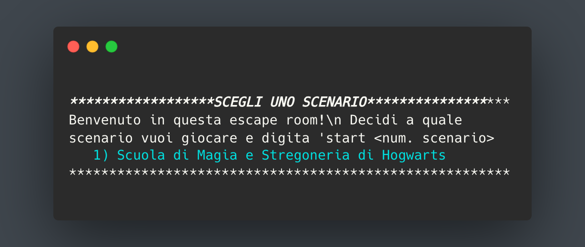
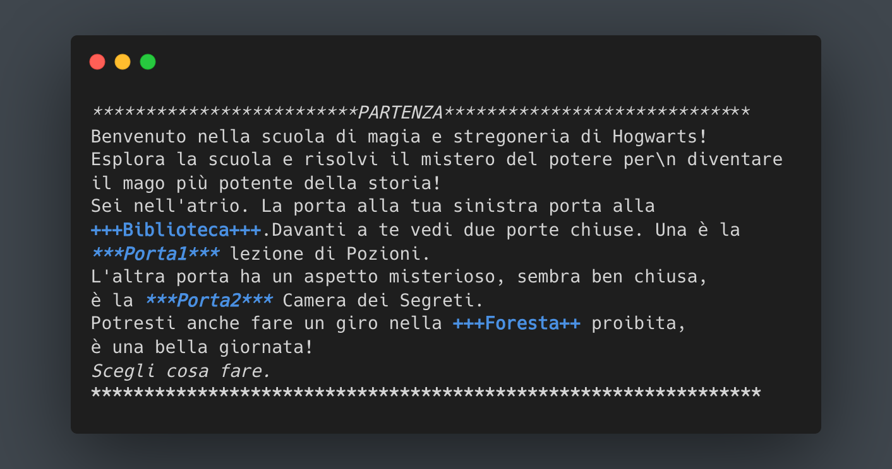

# EscapeRoomPJ-C

For my computer networks course, I developed a client-server application that recreates the classic Escape Room game. This project involved designing and implementing the communication protocols necessary for seamless interaction between clients and the server, providing an immersive gaming experience.

## here is an example of how the game starts

  
  

